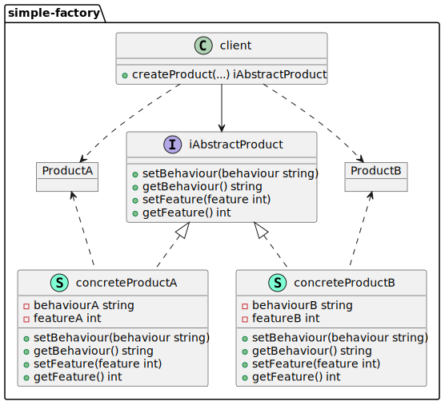

# go-dsgn-pttrn-simple-factory

> A Go implementation of the Simple Factory design pattern.

Because Go does not support traditional OOP components, such as classes and inheritance, it is not possible to implement the classic Factory Method. Nevertheless, it is still possible to implement a basic Simple Factory pattern within Go.

The Simple Factory Pattern is a creational design pattern that creates wholesale objects by outsourcing object creation to a Factory Function. And so, rather than instandiating a composite literal (curly-braces notation), you make a call to a Factory Function that returns an instance of an object that you want to create, thus providing a mechanism to mutate or extend variations of a particular construct.

&nbsp;

  

